# Parallelizing the Kalman Filter

**7 May 2026**  
**Author: Darius B. Sattari**

---

## Background and Application

The Kalman Filter, introduced by R. E. Kálmán in 1960, fuses an imperfect physics-based prediction with imperfect sensor measurements to estimate a system's state. It is foundational in guidance, navigation, and control: Global Positioning System (GPS) localization, aircraft and spacecraft navigation, autonomous vehicles, robotics. Its Extended Kalman Filter (EKF) variant linearises nonlinear dynamics about the current estimate.

This project applies an EKF to micro aerial vehicle (MAV) navigation on the EuRoC `V1_01_easy` flight, which provides a 200 Hz inertial measurement unit (IMU) stream from an ADIS16448 sensor along with six-degree-of-freedom Vicon motion-capture ground truth. The IMU drives the high-rate prediction step. Because IMU-only integration drifts (accelerometer error becomes velocity error, which in turn becomes position drift), the filter also fuses a lower-rate pose update. Vicon itself is the dataset's ground truth, not an onboard sensor, so I synthesise a noisy pose stream from it: `z_k = x_{\text{Vicon},k} + \epsilon_k`, `\epsilon_k \sim \mathcal{N}(0, R)`, with `σ_pos = 1 cm`, `σ_att = 0.01 rad`. Those σ values approximate the noise statistics of a typical visual-inertial odometry (VIO) frontend, decoupling the filter evaluation from any specific VIO implementation while keeping the noise model reproducible.

---

## EKF Formulation

The 9-dimensional direct state stacks position, velocity, and attitude:

```math
x_k = [\,p_k^\top\;\;v_k^\top\;\;\theta_k^\top\,]^\top \in \mathbb{R}^9, \qquad
u_k = [\,a_{\text{body},k}^\top\;\;\omega_{\text{body},k}^\top\,]^\top
```

`p` is position, `v` is velocity, and `θ = (φ,θ,ψ)` is the roll-pitch-yaw attitude. `u_k` is the IMU input.

**Prediction.** At each 5 ms IMU step, the filter rotates body acceleration into the world frame, integrates kinematics, and propagates covariance:

```math
\begin{aligned}
a_{\text{world},k} &= R(\theta_k)\,a_{\text{body},k} - g \\
p_{k+1}^{-}      &= p_k + v_k\,\Delta t + \tfrac{1}{2}\,a_{\text{world},k}\,\Delta t^2 \\
v_{k+1}^{-}      &= v_k + a_{\text{world},k}\,\Delta t \\
\theta_{k+1}^{-} &= \theta_k + \omega_{\text{body},k}\,\Delta t \\
P_{k+1}^{-}      &= F_k\,P_k\,F_k^\top + Q_k, \qquad F_k = \tfrac{\partial f}{\partial x}
\end{aligned}
```

`Q_k` is the process-noise covariance and `F_k` is the linearised dynamics Jacobian.

**Update** (every 50 ms, when a pose measurement is available). The measurement model `h(x) = [p^\top\,\,\theta^\top]^\top` directly observes position and attitude. With innovation covariance `S_k = H_k P_k^{-} H_k^\top + R_k` and Kalman gain `K_k = P_k^{-} H_k^\top S_k^{-1}`:

```math
\begin{aligned}
y_k &= z_k - h(x_k^{-}) \\
x_k &= x_k^{-} + K_k\,y_k \\
P_k &= (I - K_k H_k)\,P_k^{-}
\end{aligned}
```

Predict runs every step; update runs only when `k mod 10 == 0`. This matches deployed navigation stacks where IMU is much faster than the absolute-pose source.

---

---
## Parallelization Overview

The EKF time loop is sequential by construction: state `x_{k+1}` depends on `x_k`. Within one realization there is nothing to parallelize. Instead, this project parallelizes a **Monte-Carlo ensemble** of `M` independent EKF realizations of the same EuRoC flight. Each runs the same IMU and ground-truth stream but with a different random number generator (RNG) key, producing a different draw of measurement noise. Aggregating thousands of these runs is the standard way to stress-test a filter, tune the process noise covariance `Q` and measurement noise covariance `R`, and compute mission-failure probabilities.

The work decomposes cleanly into an `M × N` grid (rows are realizations, columns are the `N=28712` IMU timesteps). All five implementations parallelize the row axis with **zero per-step communication**, and differ only in how rows map onto workers and how the per-row outputs are gathered.

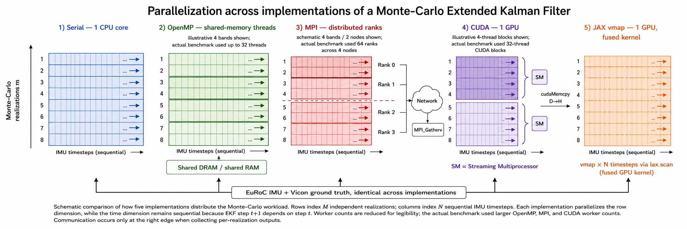

One further design contract: the inner predict and update math lives in a single header [`common/ekf_math.hpp`](../common/ekf_math.hpp), tagged `__host__ __device__` so the same C++ source compiles into the central processing unit (CPU) drivers and the graphics processing unit (GPU) kernel. Cross-implementation correctness is therefore a property of the runner shell, not the math.

### Serial

[`serial/ekf_serial.cpp`](../serial/ekf_serial.cpp) is the baseline and the source of the *golden* per-realization checksum that every other implementation is validated against. It loops over `m = 0..M-1` sequentially on one core.

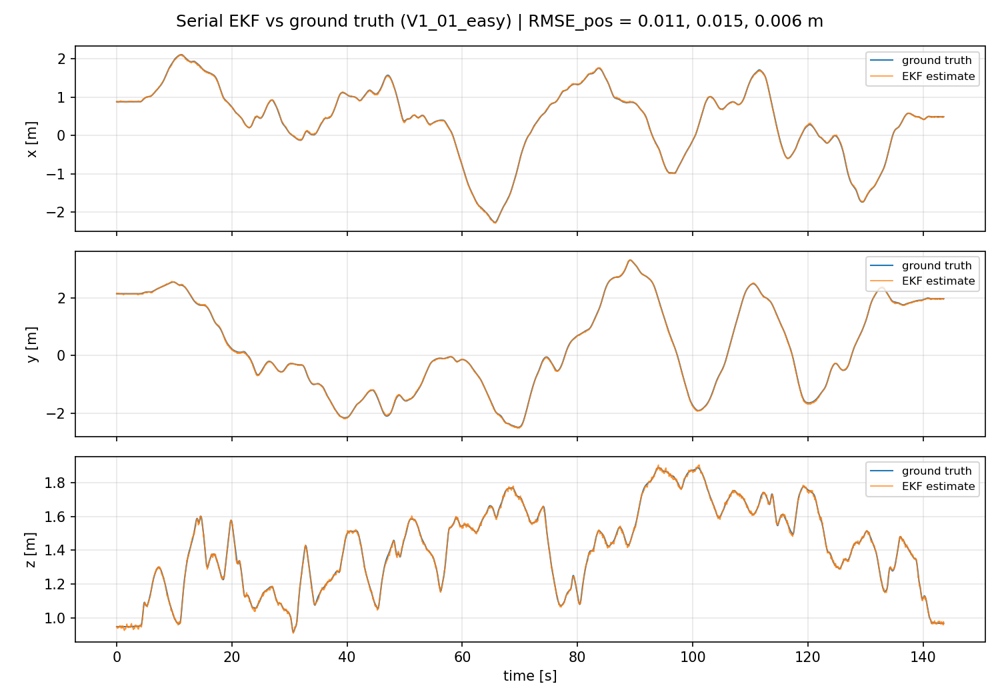

The orange estimate sits on top of the blue ground truth on all three axes. The per-axis position root-mean-squared error (RMSE) is **1.15, 1.52, 0.65 cm**, and attitude RMSE is around 0.10 rad. Those values match the magnitudes predicted by the injected `σ_pos = 1 cm`, `σ_att = 0.01 rad` noise and the 50 ms update period. At `M=1024, N=28712`, the serial run takes **11.4 s**, or **0.4 µs per filter step**, which is well below the 5 ms IMU sample period, so a single onboard core can run this filter in real time. This is the reference `T₁` for all subsequent strong-scaling.

### OpenMP

[`openmp/ekf_omp.cpp`](../openmp/ekf_omp.cpp) is a verbatim copy of the serial driver with **one** Open Multi-Processing (OpenMP) pragma added:

```cpp
#pragma omp parallel for schedule(static)
for (int m = 0; m < M; ++m) { /* identical body */ }
```

Every per-iteration object (`x[9]`, `P[81]`, RNG, noise samples) is stack-allocated and therefore implicitly private. `Q` and `R` are shared read-only, and `checksum_per_m[m]` is written only at the iteration's own index, so there is no race and no `critical` section is required. The per-realization seed is `base_seed + m` (independent of thread assignment) and the cross-realization checksum is summed in ascending-`m` order, so the result is bit-identical to serial at any thread count.

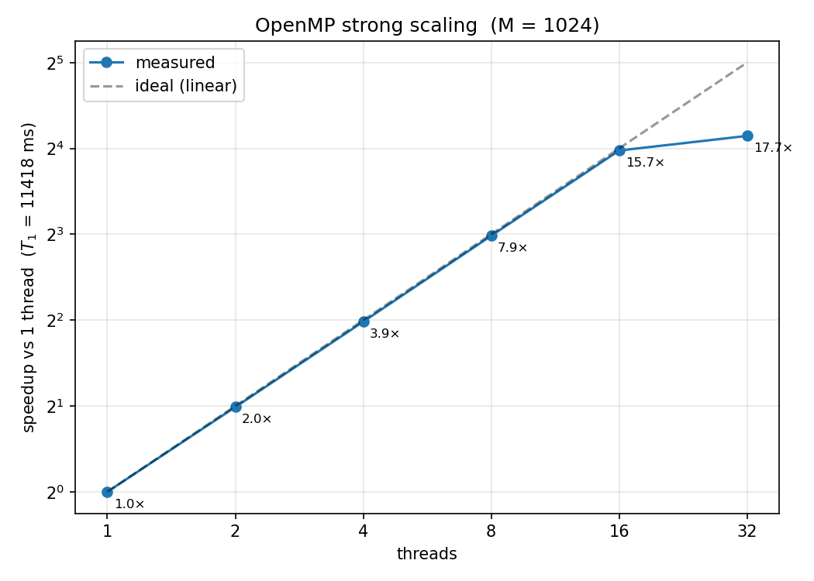
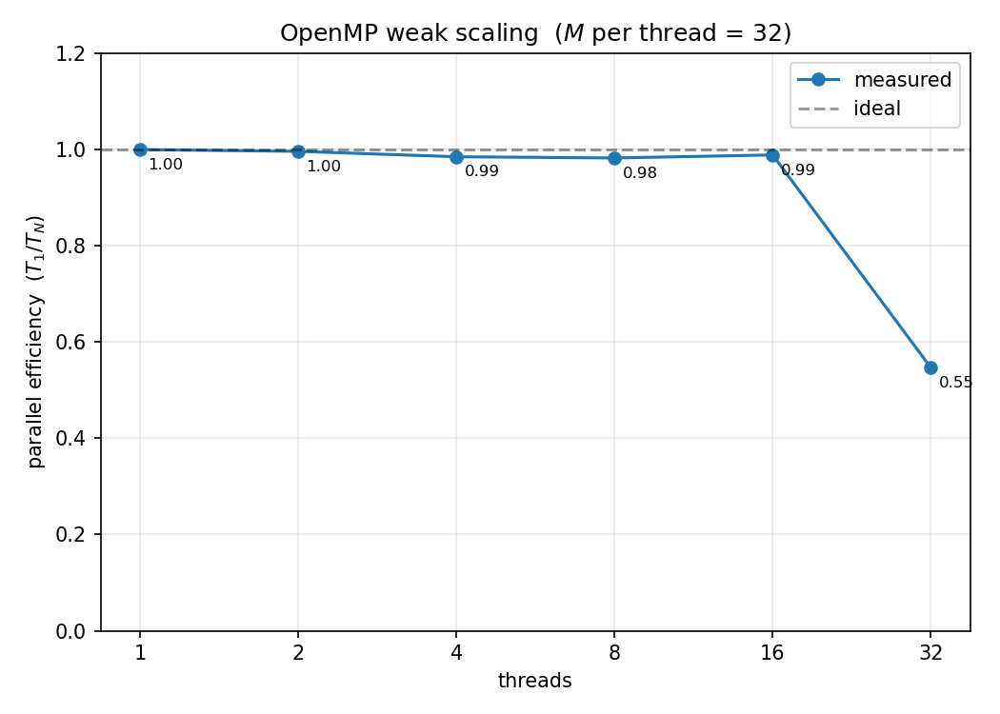

Strong scaling shows near-ideal linear speedup through 16 threads (15.83×, 99 % efficiency) followed by a sharp bend at 32 threads (17.78×, 56 % efficiency). Weak scaling shows the dual collapse from 0.97 to 0.55 efficiency. The compute node has 16 physical cores, so threads 17 through 32 are simultaneous-multithreading (SMT, the Intel Hyper-Threading variant) siblings. The Profiling section below confirms this directly with VTune barrier-spin counters. Threads are pinned via `OMP_PROC_BIND=close` and `OMP_PLACES=cores` to keep the analysis clean.

### MPI

[`mpi/ekf_mpi.cpp`](../mpi/ekf_mpi.cpp) uses Message Passing Interface (MPI) block decomposition: rank `r` of `R` owns realizations `[r·M/R, (r+1)·M/R)`. There is **no per-step communication**. The only collectives are at the end of each timed run: `MPI_Barrier` to align the timed region, `MPI_Reduce(MAX)` on rank-local wall times (the parallel wall is the slowest rank's), and `MPI_Gatherv` of per-realization checksums onto rank 0 in ascending-`m` order. Three `O(R)`-latency collectives per timed run, with a maximum payload of `M` doubles. Each rank loads its own copy of `data/v101.bin` from the shared filesystem.

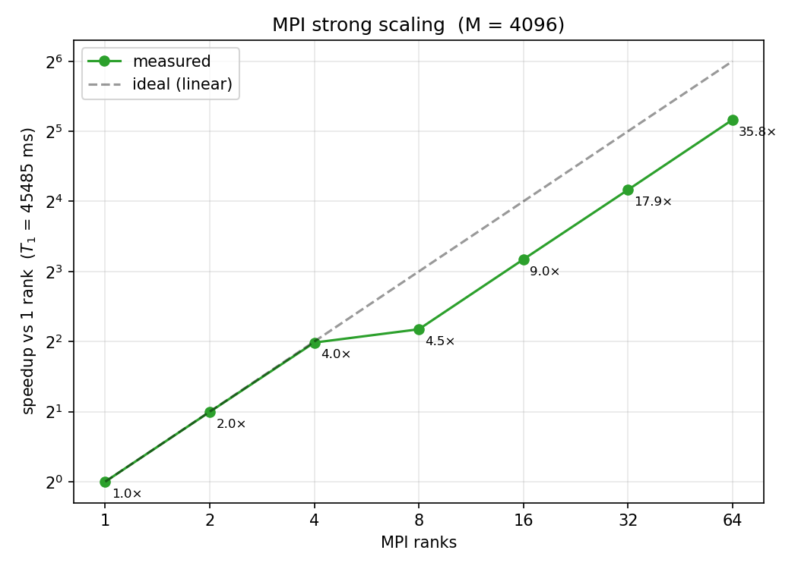
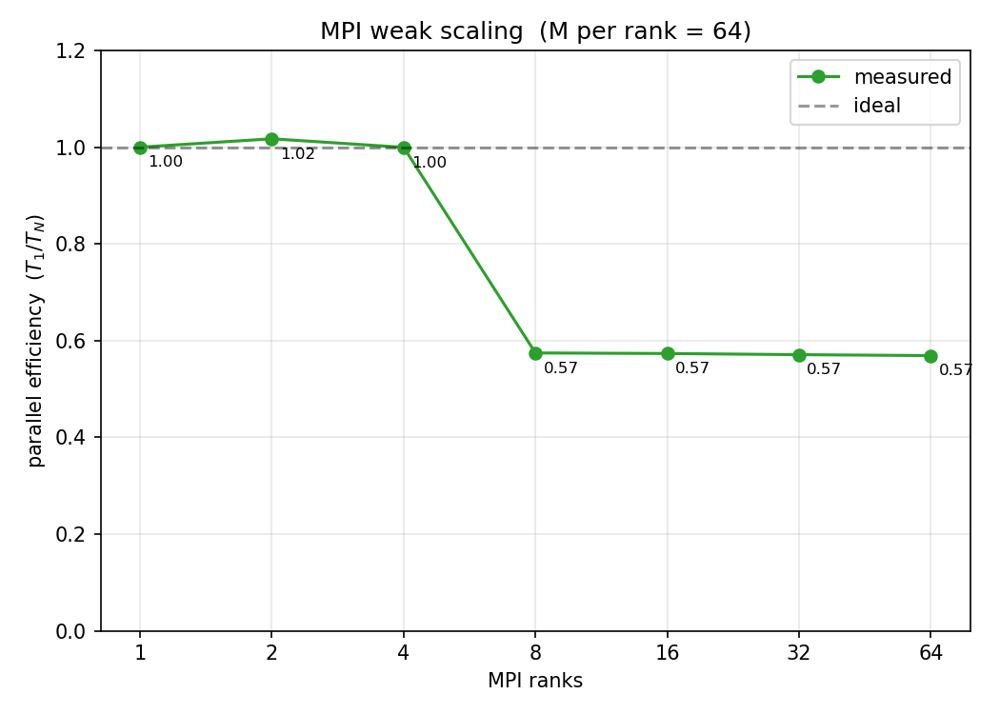

Strong scaling at `M=4096` is near-ideal through 4 ranks, stalls between 4 and 8 (4.5× rather than 8×), then resumes near-linearly through 64 ranks (35.8× total). Weak efficiency holds at 1.00 through 4 ranks, drops to 0.57 at 8, and is flat after. The Profiling section below resolves the mechanism: with zero MPI traffic in the hot loop, the lost scaling is a pure memory-system effect on the shared last-level cache (LLC). Like OpenMP, MPI uses `std::mt19937_64` with the deterministic sum order, so its `golden.csv` is bit-identical to serial's.

### CUDA

[`cuda/ekf_cuda.cu`](../cuda/ekf_cuda.cu) maps each realization to a single Compute Unified Device Architecture (CUDA) thread, with threads grouped into blocks scheduled across the L4 GPU's 58 streaming multiprocessors (SMs). The kernel calls the same `__host__ __device__` `predict()` and `update()` (including a hand-rolled 6×6 Gauss-Jordan inverse) from `common/ekf_math.hpp`, so the GPU runs the same source as the CPU drivers. CUDA cannot use `std::mt19937_64`, so it uses cuRAND's Philox4_32_10 instead. This means a different noise stream from the CPU drivers and therefore no bit-identity. Correctness is validated three ways: (1) within-CUDA determinism (Philox is counter-based, so the same seed produces a byte-identical `golden.csv`), (2) trajectory RMSE matching the CPU implementations within statistical tolerance, and (3) visual coincidence on the cross-implementation overlay (see Results).

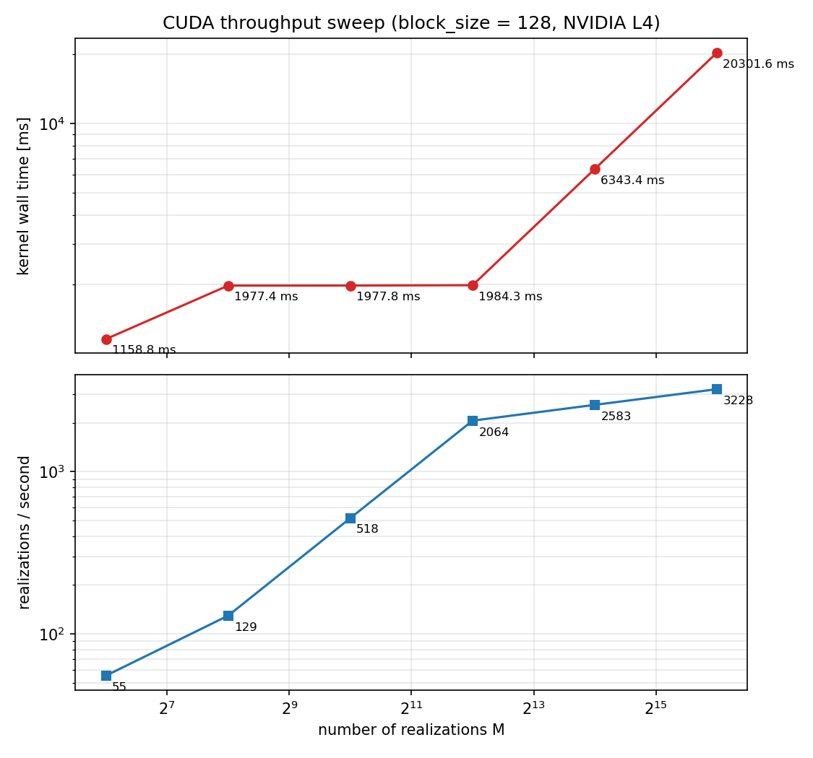
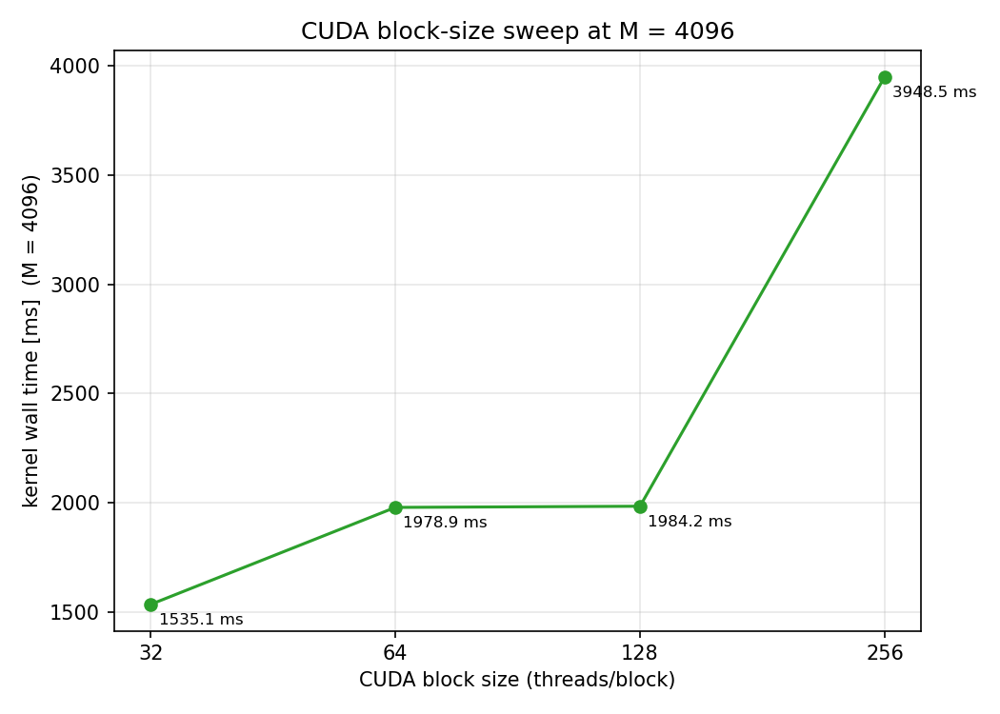

Throughput stays nearly flat at around 1.98 s for `M` between 256 and 4096 (the GPU absorbs the extra realizations for free), then grows linearly. At `M=65,536` the kernel runs in 20.3 s for **3,228 realizations per second**, the same peak as 64-rank MPI on 4 nodes. The block-size sweep at `M=4096` is more revealing: the optimum is at `block_size = 32`, and at `block_size ≥ 512` the kernel fails outright with `cudaErrorLaunchOutOfResources`. This is register-budget pressure, quantified exactly by the ptxas profile in the Profiling section.

### Additional Implementation: JAX

[`additional/ekf_jax.py`](../additional/ekf_jax.py) reformulates the EKF in functional JAX (a Python framework for accelerator-oriented array programming). Three composable transformations replace roughly 350 lines of C++:

1. `jax.lax.scan` runs the time loop within one realization.
2. `jax.vmap` adds a batch axis of size `M` over the per-realization function.
3. `jax.jit` compiles the whole stack into one Accelerated Linear Algebra (XLA) high-level optimizer (HLO) program, which runs on the same L4 GPU as CUDA.

The result is roughly **5× shorter source** than `ekf_cuda.cu`: no manual matrix multiplications, no 6×6 inverse, no host or device memory plumbing, and no launch-configuration tuning. JAX uses `jax.random.PRNGKey` rather than `mt19937_64`, so like CUDA it produces a different noise stream. Within-JAX determinism is verified by diffing two same-seed `golden.csv` files (PASS, byte-identical), and statistical correctness is verified via trajectory RMSE matching the CPU drivers.

Performance is sobering: JAX runs cleanly through `M=16,384` but thrashes on the L4 GPU around `M=65,536`. Per-realization wall time bottoms out at around 10 ms per realization, **more than 30× slower than CUDA on the same GPU**, with an additional 5 to 7 s one-time just-in-time (JIT) compilation cost. The Profiling section decomposes where that wall time goes. The headline trade-off is *ease of development against raw performance*: JAX is the right tool for prototyping, not for a deployed implementation.

---

## Results

All five implementations produce numerically equivalent filters: per-axis position RMSE around 1 cm in `x` and `y`, sub-centimeter in `z`, and wrap-aware attitude RMSE around 0.10 rad.

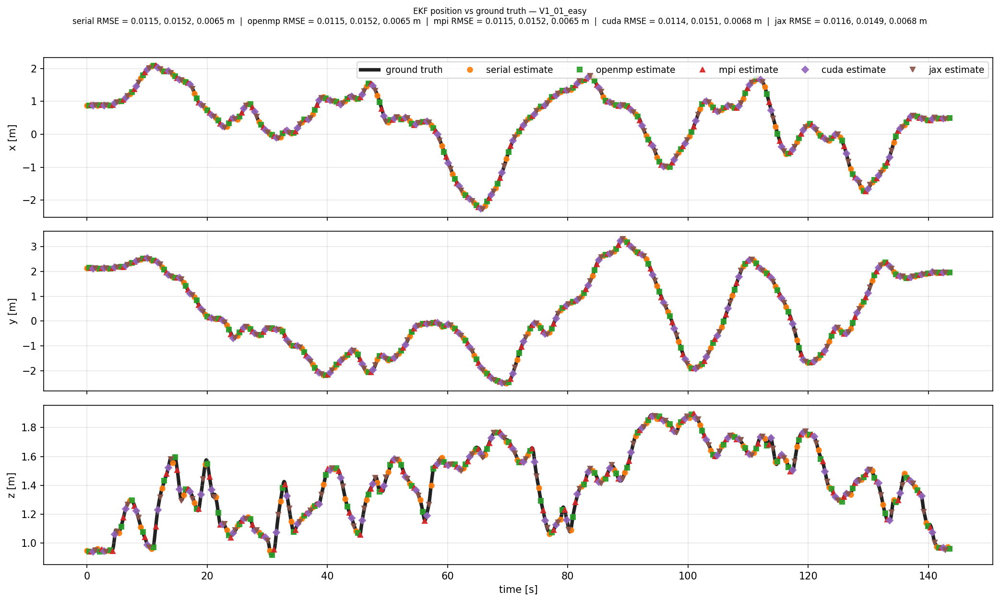

The five colours interlace because the estimates are statistically equivalent; the title prints per-axis RMSE for each, matching to the third decimal. The residual figure quantifies the agreement at the bit level:

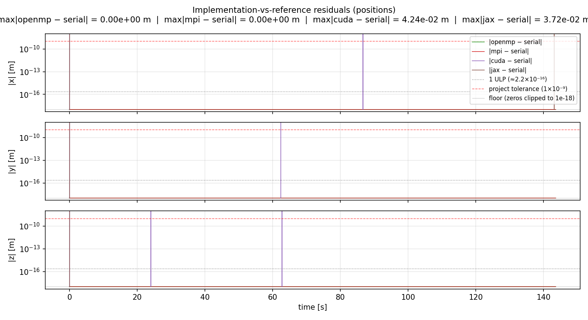

For OpenMP and MPI, `max|impl − serial| = 0.00e+00 m` *exactly*, bit-identical to serial. CUDA and JAX use different RNGs (Philox and `jax.random.PRNGKey` respectively), so their residuals are at the centimeter level: the expected statistical noise between independent draws of the same Gaussian process. Parallelization does not degrade the estimator.

### Performance comparison

Each curve picks each implementation's best configuration: serial (1 thread), OpenMP (32 threads), MPI (64 ranks across 4 nodes), CUDA (one L4 GPU, block=128), JAX (same L4 GPU).

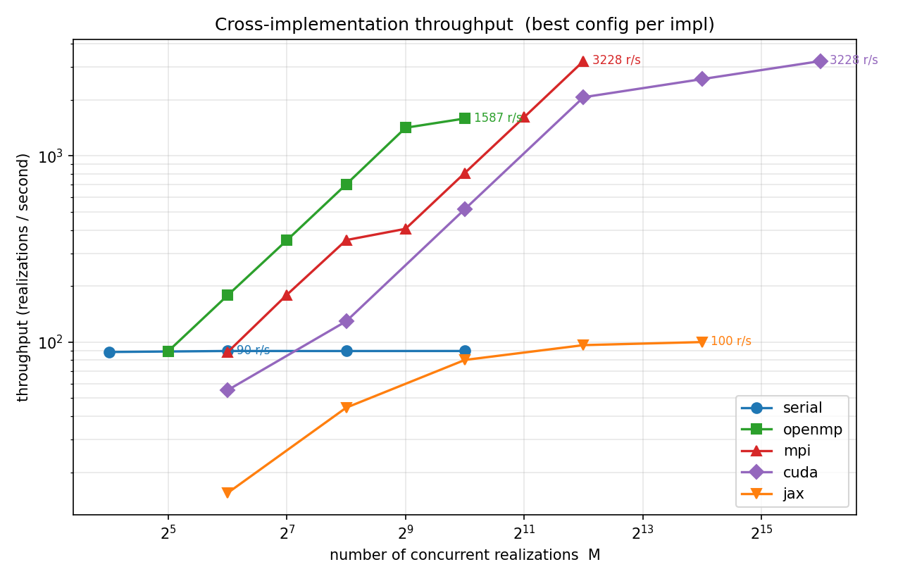
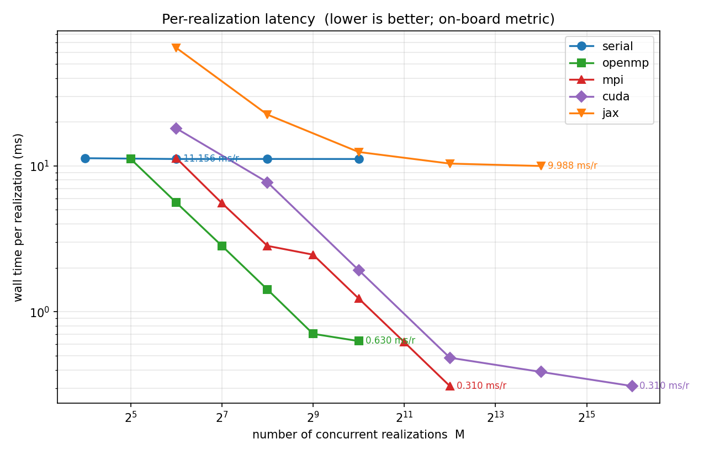

| Implementation | Best M | Wall (ms) | Throughput (r/s) | ms / realization |
|---|---|---|---|---|
| Serial | 64 | 714 | 90 | 11.16 |
| OpenMP (32 threads) | 1024 | 645 | 1,587 | 0.63 |
| MPI (64 ranks) | 4096 | 1,269 | **3,228** | **0.31** |
| CUDA (L4 GPU) | 65536 | 20,302 | **3,228** | **0.31** |
| JAX (L4 GPU) | 16384 | 163,651 | 100 | 9.99 |

A 4-node MPI cluster and a single L4 GPU produce *identical* peak throughput, 3,228 realizations per second, by completely different routes. OpenMP on one node achieves about half. JAX is 30× slower than CUDA on the same GPU, which is the cost of the compiler-mediated abstraction.

### Profiling and bottleneck analysis

I profiled each parallel implementation with the appropriate tool: **Intel VTune Profiler 2024.3** for OpenMP and MPI, **`nvcc -Xptxas=-v`** for CUDA register and shared-memory accounting, and **`jax.profiler.trace`** for the JAX XLA op timeline. The scaling sweeps already pointed at bottlenecks; the profilers confirm each with hardware-counter or compiler evidence.

**OpenMP at 16 versus 32 threads, an SMT barrier-spin signature.** VTune `hotspots` at `T=16` versus `T=32`:

| metric | T = 16 | T = 32 | change |
|---|---:|---:|---|
| Elapsed (wall) Time | 1.342 s | 1.270 s | only −5 % |
| CPU Time | 1.590 s | 2.870 s | **+80 %** |
| Spin Time (Imbalance / Serial spin) | 0.150 s | 0.578 s | **+285 %** |
| OpenMP barrier wait, % of CPU | 9.4 % | 18.7 % | doubled |

Doubling the thread count nearly doubles CPU time but barely changes wall time. Threads 17 through 32 are SMT siblings sharing execution units on the same physical core, so they add no real compute but burn 4× more time spinning at OpenMP barriers. The top hotspot (`ekf::matmul_AB_T`, around 40 % of CPU) is unchanged: no algorithmic regression, only contention.

**MPI at 4 versus 8 ranks, shared-LLC saturation rather than NUMA.** The compute node is single-socket (Intel Xeon Platinum 8275CL, 24 physical cores, one non-uniform memory access (NUMA) node), which makes the original "NUMA boundary" framing wrong. VTune `hpc-performance` on rank 0 confirms zero accesses to dynamic random access memory (DRAM) outside the cache hierarchy (`DRAM Bound = 0.0 %, NUMA remote accesses = 0.0 %`), with **vectorisation only 16.2 % packed (84 % scalar)** because 9-by-9 matrices do not fill 256-bit lanes, a structural per-rank ceiling. VTune `hotspots` over full 4-rank and 8-rank runs at `M=2048`:

| metric | 4 ranks | 8 ranks | change |
|---|---:|---:|---|
| Elapsed (wall) Time | 27.36 s | 24.28 s | only −11 % |
| Total CPU Time | 92.99 s | 164.78 s | **+77 %** |
| `ekf::matmul_AB_T` % of CPU | 41.5 % | 42.3 % | flat |

Same family as OpenMP at `T=32`: doubling rank count nearly doubles CPU time (1.77×) but barely changes wall (1.13× speedup, around 57 % parallel efficiency), with the hotspot mix unchanged. The corrected mechanism is shared-LLC saturation on one socket plus inter-node MPI transit at higher counts, not inter-socket NUMA traffic.

**CUDA register pressure, exact and quantitative.** Recompiling `ekf_cuda` with `nvcc -Xptxas=-v`:

```
ptxas info : Used 255 registers, 3472 bytes cumulative stack size,
             1140 bytes spill stores, 1308 bytes spill loads
```

255 is the per-thread maximum. The compiler also placed 3,472 bytes of state in local memory and emitted more than 1 KB of spill traffic. Feeding that into the L4 SM register file (65,536 registers per SM, 48 warps per SM):

| block | warps/block | regs/block | blocks/SM | theoretical occ | status |
|------:|------------:|-----------:|----------:|----------------:|:-------|
| 32 | 1 | 8,192 | 8 | 16.7 % | OK |
| 128 | 4 | 32,768 | 2 | 16.7 % | OK |
| 256 | 8 | 65,536 | 1 | 16.7 % | OK (at limit) |
| 512 | 16 | 131,072 | 0 | n/a | **regs/block > regs/SM** |

This matches the empirical block-size sweep exactly: blocks of 256 or fewer threads launch, blocks of 512 or more fail with `cudaErrorLaunchOutOfResources` (16 warps × 8,192 registers = 131,072, double the SM register file). Theoretical occupancy is capped at 16.7 % (8 of 48 warps active), which starves the SM of warps to interleave. A cooperative-blocks redesign that splits the 9-by-9 covariance update across threads of one block would drop registers per thread well below 64 and unlock full occupancy, which is the natural next-step CUDA optimisation.

**JAX `PjitFunction` self-time and high-bandwidth memory (HBM) accounting.** `jax.profiler.trace` at `M=16,384`, top ops by self-time:

| rank | self-time | XLA op |
|---:|---:|:--|
| 1 | 315.3 s | `PjitFunction(run_one_final)` (JIT-compiled scan body) |
| 2 |  86.6 s | `cuStreamSynchronize` (host wait) |
| 3 |  38.0 s | cuBLAS `gemmSN_TN_kernel<double, 128, ...>` |
| 4 |  15.8 s | cuBLAS `gemmSN_NN_kernel<double, 128, ...>` |

Cost is dominated by the scan body and host-side stream synchronisation. This corroborates the roughly 30× JAX-versus-CUDA throughput gap: cuBLAS small-N general matrix multiplications (GEMMs) on 6-by-6 and 9-by-9 matrices, plus XLA dispatch overhead, dominate, not the matrix multiplication math itself. The pre-generated noise tensor extrapolates to 2.1, 4.2, and 8.4 GB at `M` of 16,384, 32,768, and 65,536. Each fits inside the L4's 24 GB of HBM in isolation, but XLA's working set pushes the total past the device's free pool. Streaming noise via `jax.random.fold_in` would resolve it.

The four diagnoses now rest on profiler output rather than inferred slopes, and one of them (the MPI NUMA story) was outright corrected by the VTune topology readout.

### What to deploy

For onboard avionics, where one filter consumes one IMU stream in real time, serial CPU wins. Its 0.4 µs per step is far below the 5 ms IMU period, with no cold-start, no JIT compilation, no kernel launches, and predictable timing. For ground-side post-processing (thousands of Monte-Carlo log replays for `Q` and `R` tuning or sensor sensitivity), MPI on a small cluster *or* a single L4 GPU are tied at 3,228 realizations per second. JAX is appropriate when prototyping a new filter design where source-line iteration speed matters more than runtime.

## Validity of Methods

The validation setup uses the EuRoC Vicon ground truth in two roles: as the reference trajectory for measuring EKF accuracy, and (when corrupted with Gaussian noise) as a surrogate for an onboard absolute-pose sensor a deployed MAV would carry, such as GPS, VIO, light detection and ranging (LiDAR), or ultra-wideband (UWB) localization. EuRoC's stereo cameras could in principle support a real VIO frontend, but that is a separate project. Monte-Carlo over noisy pose draws is the conventional way to stress-test such filters in practice (`Q` and `R` tuning, sensor-quality sensitivity, mission-failure probability), so the methodology is standard rather than contrived.

## Conclusion

Five implementations of a nine-state EKF fusing a 200 Hz IMU with a 20 Hz noisy pose track the EuRoC `V1_01_easy` flight with sub-2-centimeter position error and around 0.1 rad attitude error, matching to numerical precision. The four parallel implementations share one design (Monte-Carlo realizations along the row axis of an `M × N` grid, with zero communication inside the time loop) and differ only in how rows map onto workers.

Each scaling bottleneck was confirmed by its appropriate profiler. VTune showed OpenMP at `T=32` spending 4× more CPU time in barrier spin than at `T=16`, identifying the bottleneck as Hyper-Threading contention rather than memory bandwidth. VTune on MPI corrected my "NUMA boundary" inference: the 24-core node is single-socket, so the slowdown going from 4 ranks to 8 ranks is shared-LLC saturation plus inter-node MPI transit. `nvcc -Xptxas=-v` showed the CUDA kernel using the maximum 255 registers per thread with more than 1 KB of spill traffic, capping occupancy at 16.7 % and exactly explaining the empirical block-size cap at 256. `jax.profiler` showed JAX time dominated by the JIT-compiled scan body and host-side stream synchronisation.

The headline result is that **a single L4 GPU and a 64-rank MPI cluster across 4 nodes produce identical peak throughput (3,228 realizations per second)** by completely different routes. The choice between them on a real project is driven by infrastructure cost and ecosystem fit, not raw performance. JAX trades roughly 30× in performance for around 5× shorter source code, which is appropriate for prototyping but not for deployment. For onboard avionics, **serial CPU on a single core** is the right choice: 0.4 µs per step is far below the 5 ms IMU period.

Future work has three directions. First, extend to a 15-state error-state EKF that tracks IMU biases. Second, replace the synthesised noisy Vicon stream with a real VIO frontend on the EuRoC stereo cameras. Third, act on the CUDA register-pressure finding by redesigning the kernel as cooperative blocks that split the 9-by-9 covariance update across threads of one block, dropping registers per thread well below 64 and unlocking full L4 occupancy.
